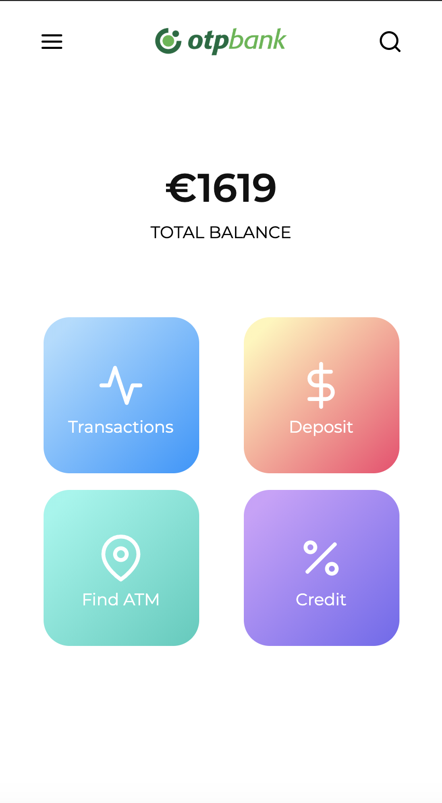
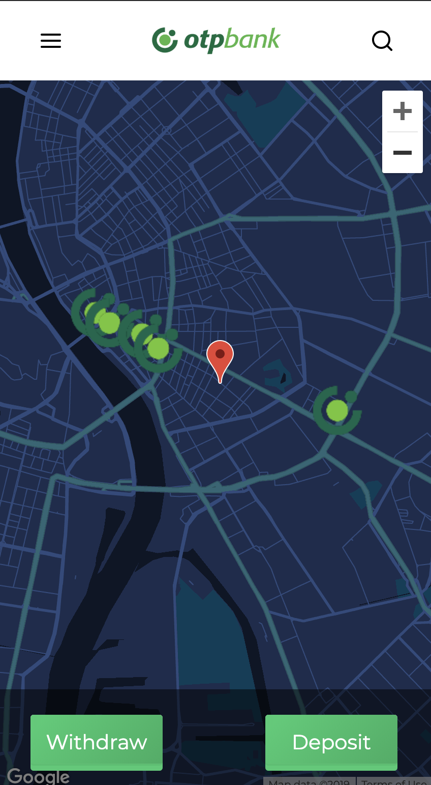
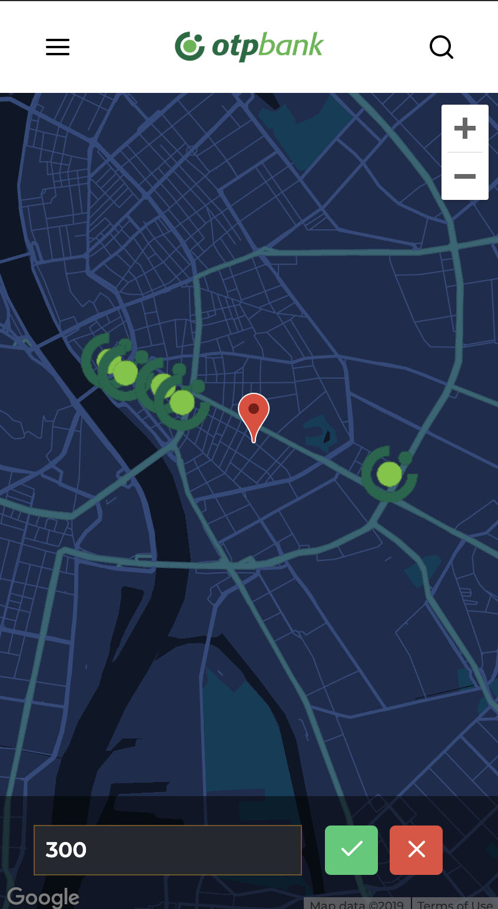
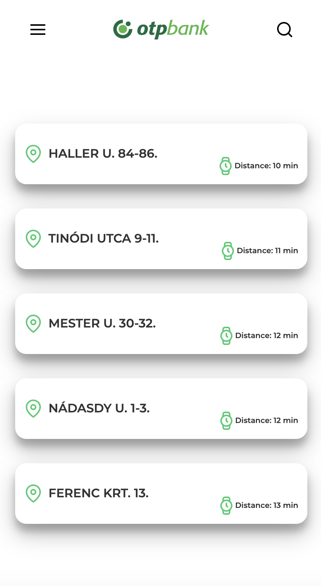
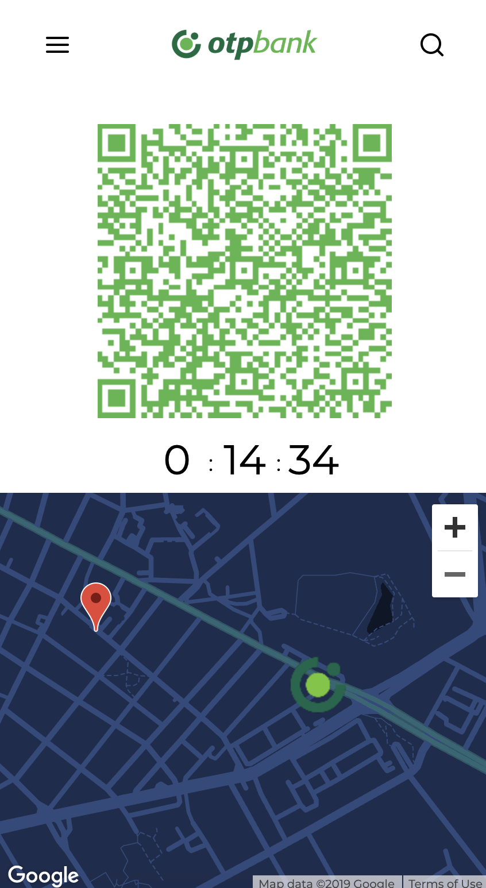
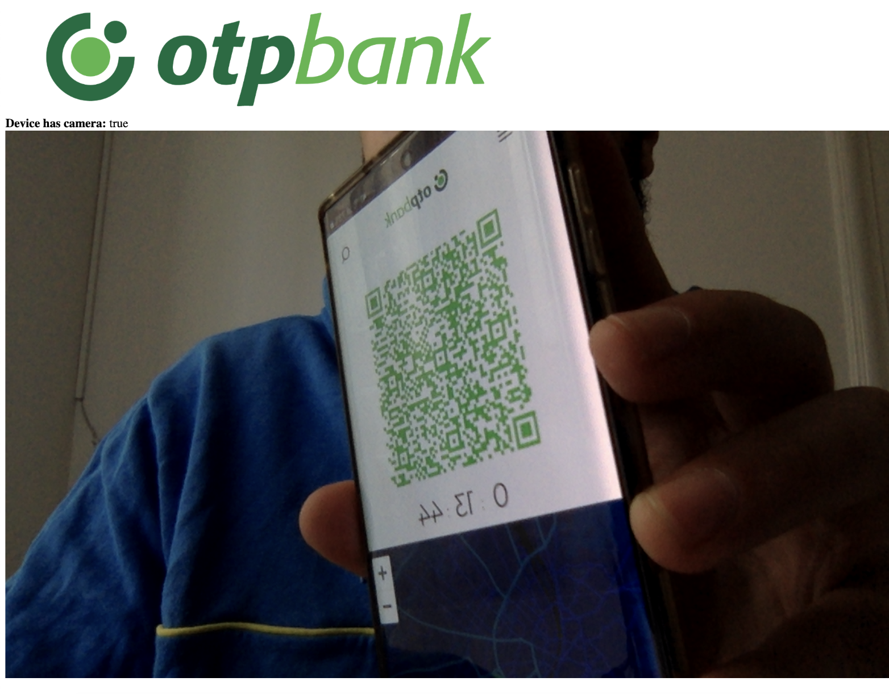

# Rectop 🏧

> Recommendation engine for ATM search based on workload

## Components 🔧

* [backend](backend/README.md)
* [frontend](frontend/README.md)
* [ATM](atm/README.md)

## Demo 👨🏻‍💻
### Mobile 📱

_Main menu screen_

_Choose deposit or withdraw_

_Choose withdraw amount_

_Recomended ATMs screen_

_Mobile QR code & mini map screen_

### Mobile 🏧 (With really ugly UI)

_Scan screen (after choosing quick cash option)_

_Success withdraw screen_